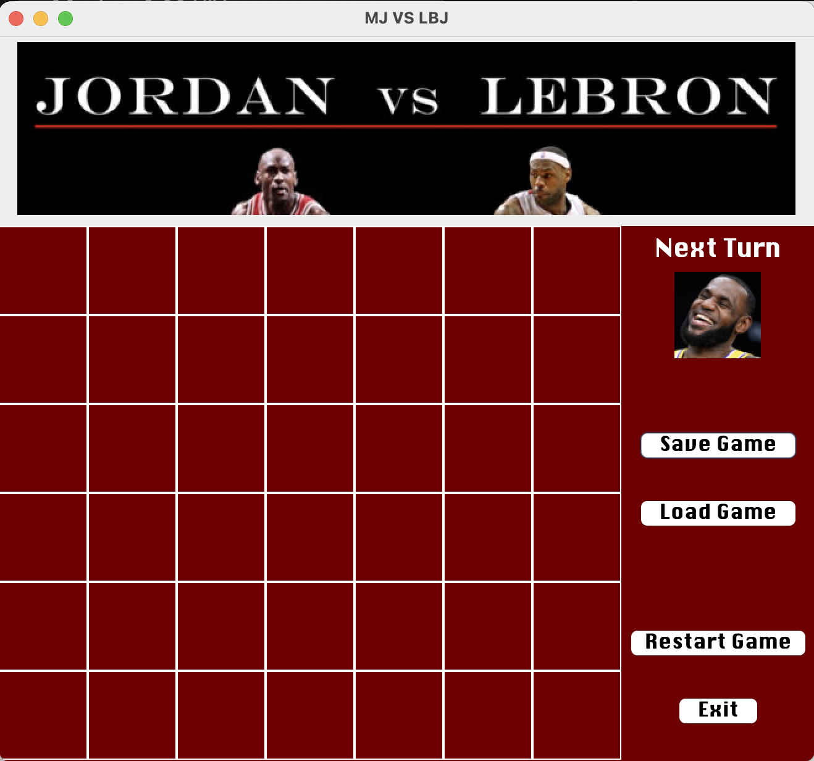

# Connect Four: Jordan vs LeBron 🎮🏀

## Description
Welcome to **Connect Four: Jordan vs LeBron**, a fun and interactive Connect Four game built using **Java**. Why not settle the GOAT debate with a fun game of Connect Four? The game features a custom GUI and even a **save-game system** to track your progress.

This project was perfect for me as basketball fan and a Java enthusiast to practice my coding and gaming skills! 🏀💻

## Features
- **Graphical Interface**: Beautifully designed with Java's GUI library to create an immersive game experience.
- **Two-Player Mode**: Challenge a friend to go head-to-head with the legendary basketball icons, Jordan and LeBron.
- **Save-Game Functionality**: Store your game progress and pick up where you left off. Perfect for hosting tournaments! 🏆

## Screenshots 📸
Check out the game's interface below:

## How to Play 🎮
1. **Launch the Game**: Run the ConnectFourGUI.java file and enjoy the stylized game interface.
2. **Choose Your Player**: Select to play first as LeBron or second as Jordan.
3. **Take Turns**: Players take turns dropping their icons into the grid. The goal is to get four in a row vertically, horizontally, or diagonally.
4. **Save Game**: Save your progress mid-game and continue later.
5. **Win**: Be the first to align four MJs/LBJs and win the game!
